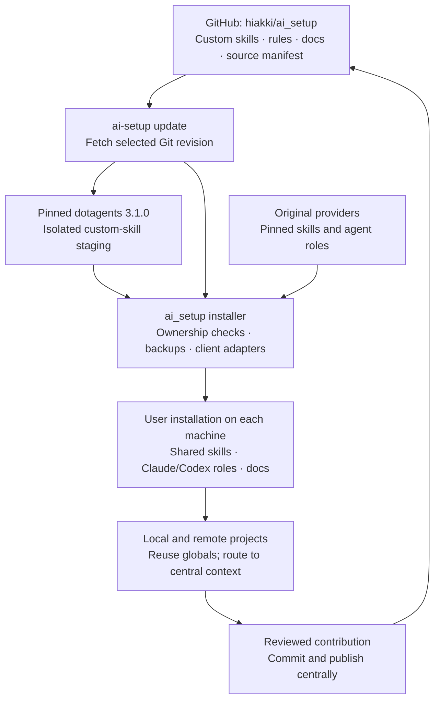

# One shared AI setup across projects and machines

**Maintain skills, agent selections, rules and documentation in a central library; install shared material once per user on each machine; update it from an approved Git revision.** Projects reuse globals and route to central project context. Private documentation requires a separately authorized private library.

This implementation uses GitHub as the central source, pinned Sentry dotagents for custom-skill staging, and the existing `ai_setup` installer for actual Claude Code and Codex integration. It requires no paid hosting service, database, always-running server or scheduled job.

## The problem this solves

A useful CI/CD skill developed in one project should also be available in another project or on a remote server. Copying folders manually creates competing versions and loses supporting references. Repeating a full machine bootstrap for every content update adds unnecessary downloads and runtime changes.

The hub separates three operations:

1. **Bootstrap:** prepare a machine and its user-level AI clients once.
2. **Update:** apply approved shared content to that user's existing installation.
3. **Contribute:** return reusable improvements to the central source for review.

## Architecture and ownership



| Material | Canonical source | Machine installation |
| --- | --- | --- |
| Authored custom skills and references | `custom/skills/<name>/` in this repository | `~/.agents/skills/<name>/`; Claude links to the shared copy |
| Third-party skills | Original provider; selection and commit recorded in `manifest.json` | Downloaded by the existing provider pipeline |
| Provider specialist roles | Original provider; selected paths in `manifest.json` | Claude Markdown and Codex TOML adapters |
| Authored shared roles | `custom/agents/<name>.md` | Claude Markdown and Codex TOML adapters |
| Shared rules | `config/` in this repository | Managed blocks in the user's client instruction files |
| Shared documentation | Repository Markdown and supporting reference files | `~/.local/share/ai-setup/docs/README.md` |
| Project-specific authored context | Central `docs/projects/<project>/`; private library for private facts | Minimal local routing pointers; generated runtime evidence stays local |

Here, `~` means the selected user's home. On native Windows it is that user's profile. A server with several user accounts needs an installation for each account that should use these tools.

### Why dotagents is isolated

The existing installer already tracks ownership of global skills, client configuration and adapters. Allowing two tools to manage those same destinations would make conflicts and recovery harder to reason about.

`dotagents_runtime.py` therefore installs **both `@sentry/dotagents` and `@sentry/dotagents-lib` at 3.1.0** under `~/.local/share/ai-setup/dotagents/`. It generates an isolated home and configuration with `agents = []`, copies validated custom inputs inside that scope, and invokes the real provider CLI. Every resulting skill file is checked against its source before the existing installer imports it.

dotagents does **not** own the real Claude/Codex configuration or distribute the provider roles in this implementation. Third-party material continues coming directly from its original provider. Generated packages, caches, configuration and payloads stay outside Git.

## 1. Install on a new machine

Use the supported platform's normal bootstrap from the published checkout. This includes the `docs` and `hub` components:

```bash
git clone https://github.com/hiakki/ai_setup.git
cd ai_setup
bash install.sh
```

Native Windows, from the checkout:

```powershell
powershell -ExecutionPolicy Bypass -File .\install.ps1
```

See the [installation guide](../README.md#install) for supported operating systems, disk requirements and prerequisites. Native Windows does not require Ubuntu or WSL. Log into Claude Code and Codex separately; credentials are never carried in the shared source.

Start a new shell/client after installation. The command `ai-setup status` then shows the selected home, installed shared components, central revision when recorded, documentation location and detected local edits.

## 2. Add the hub to an existing setup

From this updated checkout:

```bash
bash install.sh install --only custom,docs,hub
```

```powershell
.\install.ps1 -Only 'custom,docs,hub'
```

For an already compatible environment, use the existing installer interpreter directly to avoid OS bootstrap:

```bash
"$HOME/.local/share/ai-setup/venv/bin/python" setup.py install --only custom,docs,hub
```

```powershell
& "$HOME/.local/share/ai-setup/venv/Scripts/python.exe" setup.py install --only 'custom,docs,hub'
```

This installs the custom content, shared documentation and update command. It also adds short global guidance telling agents where shared knowledge lives and how to propose reusable changes. Existing provider skills and roles remain installed; newly requested components must be bootstrapped explicitly before the hub can update them.

If `ai-setup` is not yet on PATH, use `~/.local/bin/ai-setup` on Unix or `& "$HOME/.local/bin/ai-setup.cmd"` in PowerShell. A full bootstrap configures normal command discovery.

## 3. Update from the central repository

These installed commands work from any project directory, including a remote machine:

```bash
ai-setup status
ai-setup update
ai-setup status
```

The default source is `https://github.com/hiakki/ai_setup.git`, with `main` as the requested revision. The fetched commit is recorded. For controlled rollout, prefer an approved immutable commit or a release tag that your team does not move:

```bash
ai-setup update --ref APPROVED_COMMIT_SHA
ai-setup update --ref APPROVED_COMMIT_SHA --only custom,docs,hub
```

Replace `APPROVED_COMMIT_SHA` with a real published commit. To use a fork or another trusted Git host:

```bash
ai-setup update --source https://github.com/YOUR_ORG/ai_setup.git --ref main
```

An update executes installer code from the selected repository; choose a source and revision you trust. Private repositories need Git authentication configured on that machine. Model credentials remain separate.

The hub updates only already-installed members of `skills,agents,custom,rules,docs,hub`. It does not update runtimes, browsers, blog/gstack suites, Hermes, MCP integrations or optional tools. Those retain their component-specific installation flows. Updates run only when requested; no watcher, scheduled synchronization or service is installed.

**Publication matters:** other machines can fetch a change only after it has been committed and pushed. A local implementation or passing test does not make unpublished files available from GitHub.

### Apply changes from a local checkout

The launcher `update` action applies files already present in the checkout; it does not pull GitHub:

```bash
bash install.sh update --only custom,docs,hub
```

```powershell
.\install.ps1 -Action update -Only 'custom,docs,hub'
```

The equivalent interpreter action is `setup.py update --only custom,docs,hub`. Use this while developing and reviewing local changes. Use the installed **`ai-setup update`** for the central Git fetch and recovery snapshot workflow. These two update entrypoints deliberately have different sources and recovery scopes.

## 4. Improve shared material from any project

Search first, locate the bound checkout, and edit its canonical file directly:

```bash
ai-setup search "portable deployment"
ai-setup library
# Edit the matching custom/skills entry or existing central document in that checkout.
ai-setup check-project --project /path/to/ai_setup
```

Use the actual path reported by `library`. The checked-out source is the maintained
copy; `~/.agents/skills/` and `~/.local/share/ai-setup/docs/` are installed consumer
copies. They need not be live symlinks to the checkout. Editing the canonical
source makes it available to central search immediately, but does not silently
reinstall it, reload a client's context, commit it or publish it. Apply a reviewed
local change through the selective update described above, or publish an approved
revision before updating another machine. Keep those actions explicit.

If an installed custom skill already contains an earlier improvement, export it
for reconciliation rather than maintaining both locations independently:

```bash
ai-setup contribute reliable-web-app-operations --checkout /path/to/ai_setup
```

On Windows, use a native path such as `--checkout 'C:\work\ai_setup'`. For a newly authored skill already placed in `~/.agents/skills/my-new-skill/`, explicitly declare its custom provenance:

```bash
ai-setup contribute my-new-skill --checkout /path/to/ai_setup --new-custom
```

The command copies the complete skill folder, preserves an existing source backup, and refuses independent checkout edits. It rejects environment files and links, but this is not an exhaustive secret detector. Review the whole diff for credentials, private project details, licenses and portability. Third-party changes belong with their provider; do not use `--new-custom` to relabel somebody else's skill.

Exporting does not commit, push or publish. After review, validate the skill and supporting links, update its catalog entry, test the selective installer, then commit and publish through your normal Git workflow. Other machines can subsequently pull that approved revision.

Shared rule, documentation and agent-selection improvements are edited directly in `config/`, `docs/` or `manifest.json`. New project-specific authored procedures belong in central `docs/projects/<project>/`; private facts require an explicitly bound private repository. Secrets and raw customer data are never library material. Generated runtime evidence can remain ignored in its project.

## Search-first authoring and enforcement

The global Claude/Codex instructions now require a central search before creating or
changing skills, agent definitions or documentation:

```sh
ai-setup search "deployment rollback"
ai-setup library
ai-setup guard status --project /path/to/project
```

The `hub` component installs a global Git dispatcher that preserves existing hooks and
rejects project-local library changes at commit time. It automatically recognizes its
bound central checkout. `ai-setup check-project --audit` can report existing/ignored
local copies without moving them. Local hook overrides and `--no-verify` bypass the
client-side guard; the supplied reusable CI workflow must be adopted and required by each
consuming repository for merge enforcement. Filesystem write blocking is not installed.

`ai-setup search "TOPIC" --refresh` applies the approved central update before searching
and fails if freshness cannot be established. Ordinary search labels local content as
not remotely checked. Private-library fetching is separate and not automated.

Read the [central authoring policy](../config/CENTRAL_LIBRARY.md) for exact paths,
exceptions, private-library binding, rollback of hook settings and enforcement limits.

## 5. Recover an update

`ai-setup update` records a recovery snapshot before applying shared content. If an applied or failed update needs reversal:

```bash
ai-setup status
ai-setup rollback
```

Rollback targets the latest update snapshot when its status is applied or failed. It checks that managed state and affected destinations have not changed since the update, preserves replaced content in the snapshot, and restores the prior shared content/state. If there are later edits, it stops for reconciliation rather than overwriting them. It is not a general machine, credential, runtime or project rollback.

Snapshots live under `~/.local/state/ai-setup/updates/`; installer merge backups live under `~/.local/state/ai-setup/backups/`. Keep those files private because existing local configuration can be included. Provider revision changes fetch separate checkouts; older source caches remain available. Retired skills are not automatically deleted from the user's installation.

## What was verified

| Evidence | Result / boundary |
| --- | --- |
| Real dotagents on macOS | All twelve custom skill folders staged twice and checked for matching complete file contents |
| Backend regression suite | Nine tests passed, including real npm install, provider update/repeat, reference/binary preservation, isolation and failure handling |
| Windows backend adapter | Unit-tested Node executable plus npm JavaScript invocation; this does not establish native Windows end-to-end execution |
| Central rollout and recovery | Eighteen hub/installer tests passed, including two isolated homes pulling a real Git fixture, rollback, edit protection, custom role adapters and contribution export; fixture sources are distinct from the public GitHub branch |
| Existing Mac installation | Twelve custom skills, docs and the command installed globally; the normal selective launcher update passed |
| Central search and authoring guard | Twelve regression tests passed; the actual Mac global hook rejected local docs, preserved existing hooks and push input, and allowed source commits |
| Full installer regression suite | 108 tests ran: 104 passed, three Windows-only checks and one opt-in network check skipped; the network check passed separately during the earlier hub verification |
| Published availability | Requires committing and pushing the implementation; no automatic publication is part of installation |
| Native Windows/Linux execution | Must be recorded separately from mocked tests or CI configuration; a workflow file alone is not a passing runner |

Run the backend's optional real provider check from a development checkout:

```bash
AI_SETUP_TEST_DOTAGENTS=1 .work/venv/bin/python -m unittest discover -s tests -p test_dotagents.py -v
```

## Operational boundaries

GitHub plus local caches is sufficient for this distribution model. There is no hosted MCP knowledge service or public documentation website in this implementation. Read the installed Markdown bundle locally, or browse the repository online.

Global installation makes compatible skills and roles discoverable; each client still decides what to load for a task. Starting a fresh client session may be necessary. Project onboarding still supplies project-specific commands and facts, and remote machines still need their initial bootstrap and account login.

The management software is open source; AI subscriptions, model calls, existing server costs and Git hosting limits remain separate. Package versions and source commits are pinned, but transitive dependency resolution and OS packages are not a byte-identical machine image.

Provider reference: [Sentry dotagents CLI, scopes and configuration](https://dotagents.sentry.dev/cli/). Implementation entrypoints: `hub.py`, `dotagents_runtime.py`, `setup.py`, `install.sh` and `install.ps1`.
